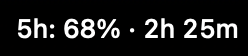
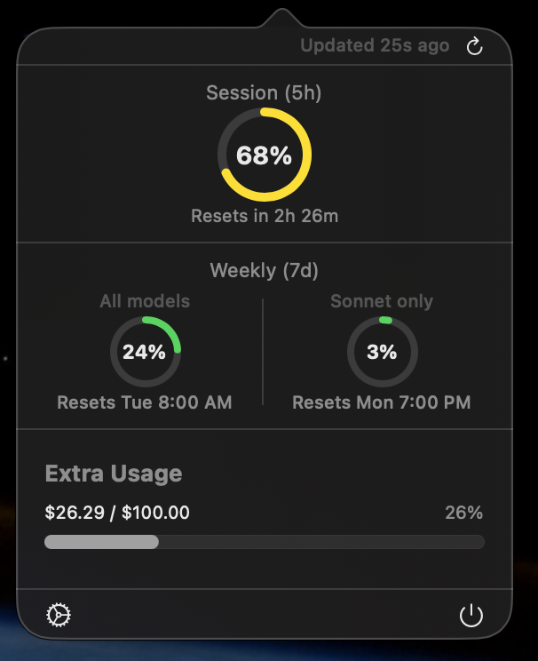
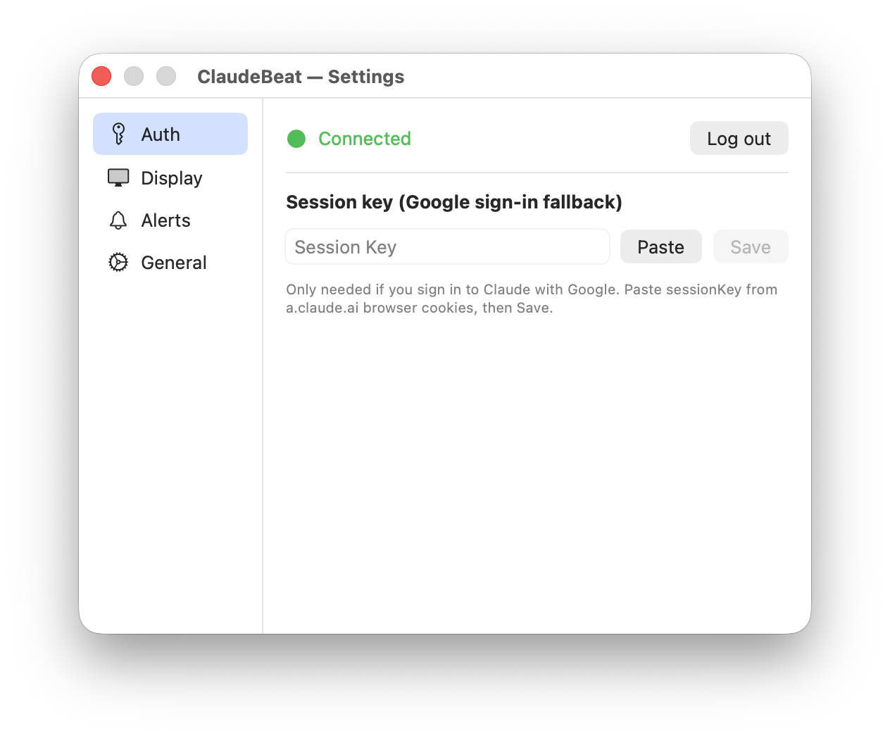
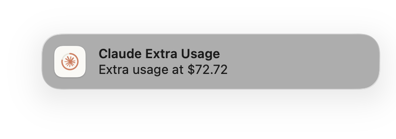

# ClaudeBeat

<p align="center">A native macOS menu bar app that monitors your Claude AI token usage in real-time.</p>

<p align="center">
  <a href="https://claudebeat.com/">Website</a>
</p>

<p align="center">
  <a href="https://github.com/taejunoh/ClaudeBeat/releases/latest/download/ClaudeBeat.zip">
    
  </a>
</p>
<p align="center">
  macOS 14+ &nbsp;·&nbsp; Verified by Apple &nbsp;·&nbsp; Just unzip and run
</p>

<p align="center">
  
  
  
  
  <a href="https://github.com/taejunoh/ClaudeBeat/releases/latest"></a>
  <a href="https://github.com/taejunoh/ClaudeBeat/releases"></a>
</p>

## Screenshots

| Menu Bar | Popover Dashboard | Settings |
|---|---|---|
|  |  |  |



## Features

- **Menu bar display** — See your current usage at a glance: `5h: 82% · 2h 54m`
- **Three display modes** — Current Session (5h), Weekly Limit (7d), or Both
- **Popover dashboard** — Click to see detailed usage with circular gauges
  - Session (5h) utilization with reset countdown
  - Weekly (7d) breakdown: All models + Sonnet only with individual reset times
  - Extra usage credits ($used / $limit)
- **Session reset notification** — Get notified when your 5h session resets so you can get back to work
- **Threshold alerts** — macOS notifications when session, weekly, or extra usage hits your configured threshold
- **Secure credential storage** — Session cookie stored in macOS Keychain, not plaintext
- **Auto-refresh** — Polls every 60 seconds (configurable 15s-5min)
- **Launch at login** — Optional auto-start

## Installation

### Homebrew (recommended)

```bash
brew install --cask taejunoh/tap/claudebeat
```

### Direct Download

Download from [GitHub Releases](https://github.com/taejunoh/ClaudeBeat/releases/latest), unzip, and drag to Applications.

## Getting Started

### Quick Start

On first launch, an onboarding window will appear. You'll need your session key from claude.ai:

1. Open [claude.ai](https://claude.ai) in your browser and log in
2. Open DevTools (`Cmd+Opt+I`) → **Application** tab
3. Sidebar → **Cookies** → `https://a.claude.ai`
4. Find `sessionKey` and copy its value
5. Click **Paste** in the app, then **Connect**

Your session key is securely stored in the macOS Keychain and persists across app restarts.

### Alternative: Claude Code OAuth

If you use [Claude Code](https://docs.anthropic.com/en/docs/claude-code), you can authenticate via OAuth instead:

1. Open Settings → Auth tab
2. Select "OAuth (Claude Code)"
3. Click "Load from Keychain"
4. Click "Test Connection"

## Menu Bar Display

| Mode | Example |
|---|---|
| Current Session | `5h: 82% · 2h 54m` |
| Weekly Limit | `7d: 7% · Apr 14` |
| Both | `5h: 82% · 2h 54m` (top) / `7d: 7% · Apr 14` (bottom) |

## Settings

Access settings via the gear icon in the popover. Uses a sidebar layout:

| Tab | Options |
|---|---|
| **Auth** | Switch between OAuth (Claude Code) and Session Cookie, test connection |
| **Display** | Menu bar mode (Session / Weekly / Both), toggle reset time visibility |
| **Alerts** | Session reset notification, threshold alerts per metric (Session 5h, Weekly 7d, Extra Usage) |
| **General** | Polling interval (15s-5min), launch at login, version info |

## What's New

### v1.0.0
- Real-time 5h session and 7d weekly usage display in menu bar
- Popover dashboard with circular gauges
- Weekly breakdown: All models + Sonnet only
- Extra usage tracking with dollar amounts
- Session reset notifications
- Configurable threshold alerts (session, weekly, extra usage)
- Secure Keychain credential storage
- Two auth methods: Session Cookie and Claude Code OAuth
- Three display modes: Session / Weekly / Both
- Customizable polling interval (15s-5min)
- Launch at login support

## Troubleshooting

### "Failed to fetch organizations" or HTTP 403
Your session key has expired. Get a fresh one from the browser:
1. Go to [claude.ai](https://claude.ai) → DevTools → Application → Cookies → `https://a.claude.ai`
2. Copy the new `sessionKey` value
3. Open Settings → Auth → Paste the new key → Test Connection

### Menu bar text not showing
If you only see a blank space in the menu bar:
- Wait a few seconds — the first data fetch takes a moment
- Click the menu bar item to check if the popover shows data
- Verify your connection in Settings → Auth → Test Connection

### Notifications not working
- Make sure you're running the `.app` bundle (not `swift run`) — notifications require a proper app bundle
- Check System Settings → Notifications → ClaudeBeat → ensure notifications are allowed
- Verify alert thresholds in Settings → Alerts

### App asks for Keychain password
This happens once when the app first accesses the Keychain. Click "Always Allow" to prevent future prompts.

### Extra Usage shows wrong amounts
The API returns values in cents. The app converts to dollars (e.g., 2629 cents → $26.29). If amounts look wrong, please [open an issue](https://github.com/taejunoh/ClaudeBeat/issues).


## Security

- Session cookie is stored in macOS Keychain (not plaintext UserDefaults)
- Automatic migration from older plaintext storage on first launch
- OAuth tokens read from Claude Code's Keychain entry (read-only)
- No data is sent to any third-party server

## Tech Stack

- **Swift + SwiftUI** — Native macOS app, macOS 14+
- **AppKit** — `NSStatusItem` for reliable menu bar updates, `NSPopover` for dashboard
- **Security** — macOS Keychain for credential storage
- **UserNotifications** — Session reset and threshold alerts
- **Swift Concurrency** — async/await with `@MainActor` for thread safety
- **No third-party dependencies**

## License

MIT
